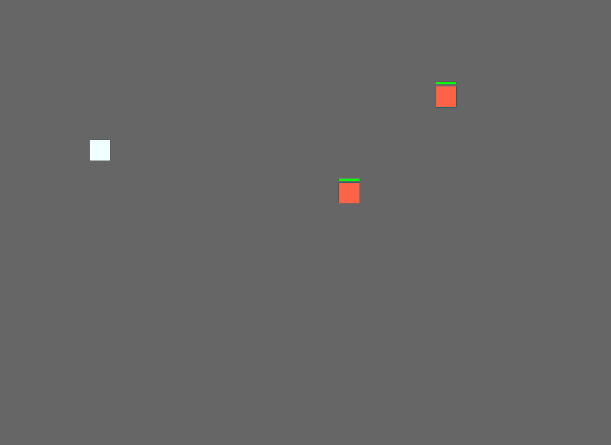
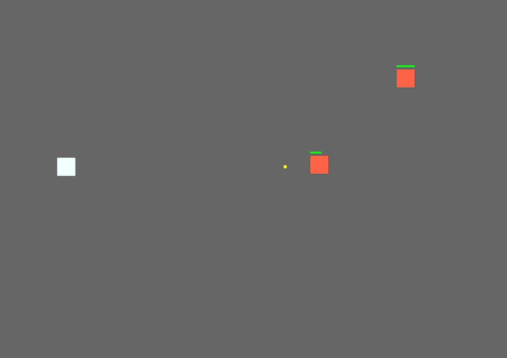
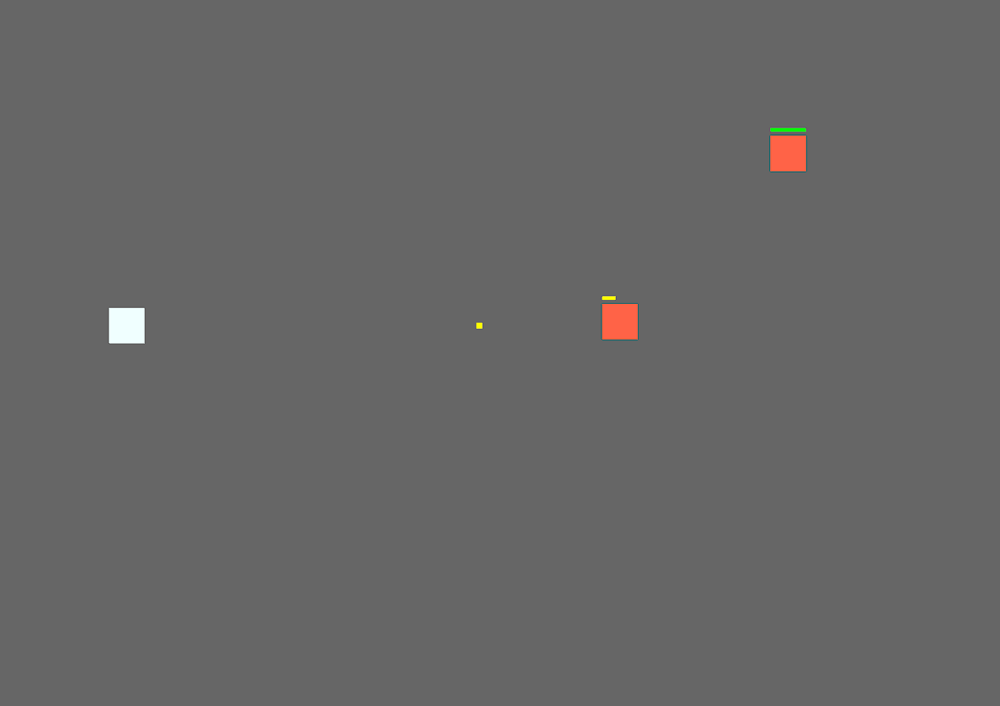

# Bevy Game

Currently, this is a demo project to help me understand the basics of the 
[Bevy Game Engine](https://bevyengine.org/). As stated on the Bevy website, Bevy is a 'refreshingly simple data-driven game engine built in Rust'. 

---
### Game Overview
This is a top-down, 2D style shooter game. 

---
### Game Controls 

| Key        | Action     |
| ---------- | ---------- |
| W          | move up    |
| D          | move right |
| S          | move down  |
| A          | move left  |
| Left Shift | sprint     |
| Space      | shoot      |

---
### Current Game State

- Player can move up, down, left & right.
- Player is able to sprint
- Player is able to shoot
- Player is restricted from shooting while sprinting
- Enemy will begin tracking the player once the player enters the enemy's 'trigger radius'.
- Enemies have a health bar and will die (despawn) once their health reaches 0.
- Collision properties exists between player and enemies. 

---
### Development Pictures

#### 04-24-2022

#### 04-22-2022

